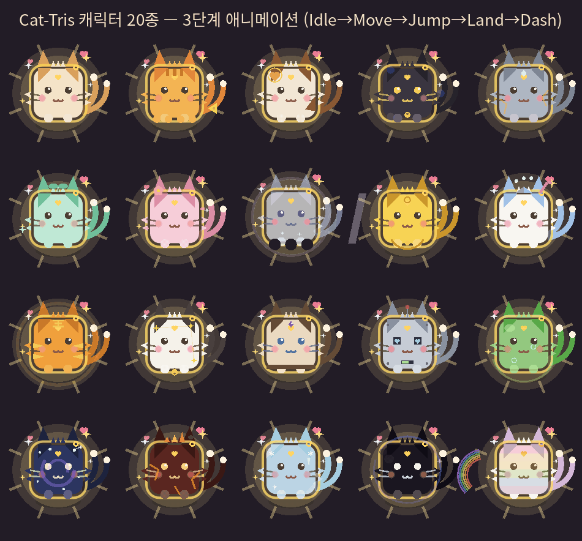
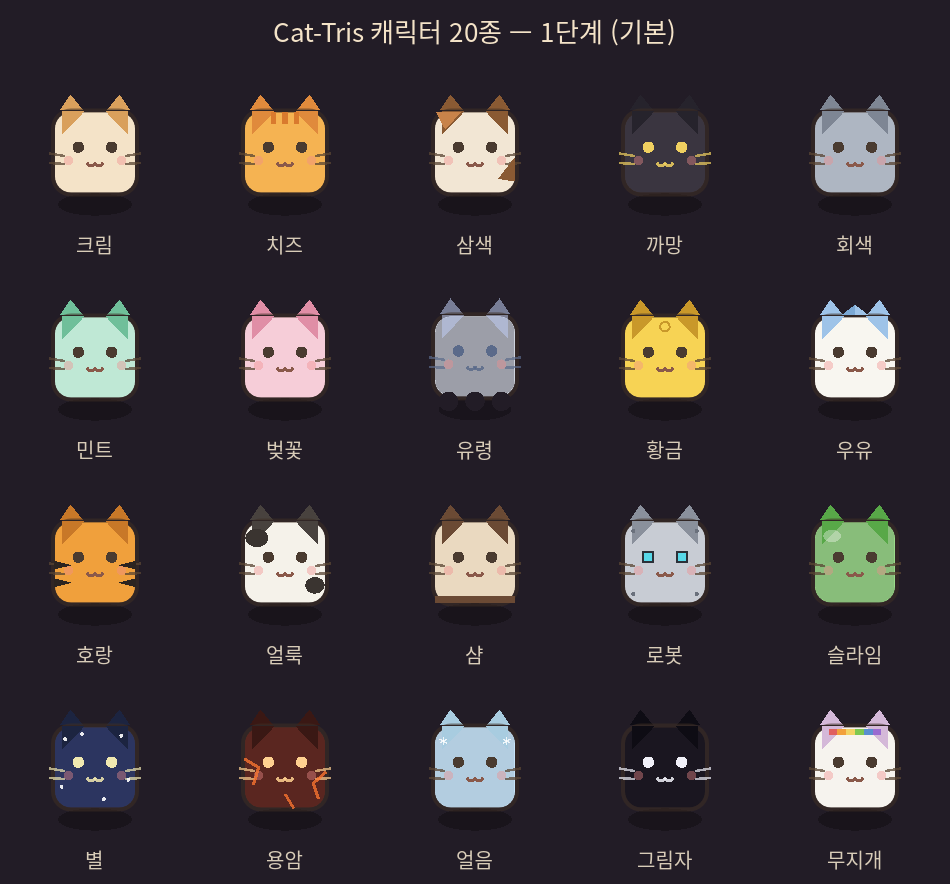
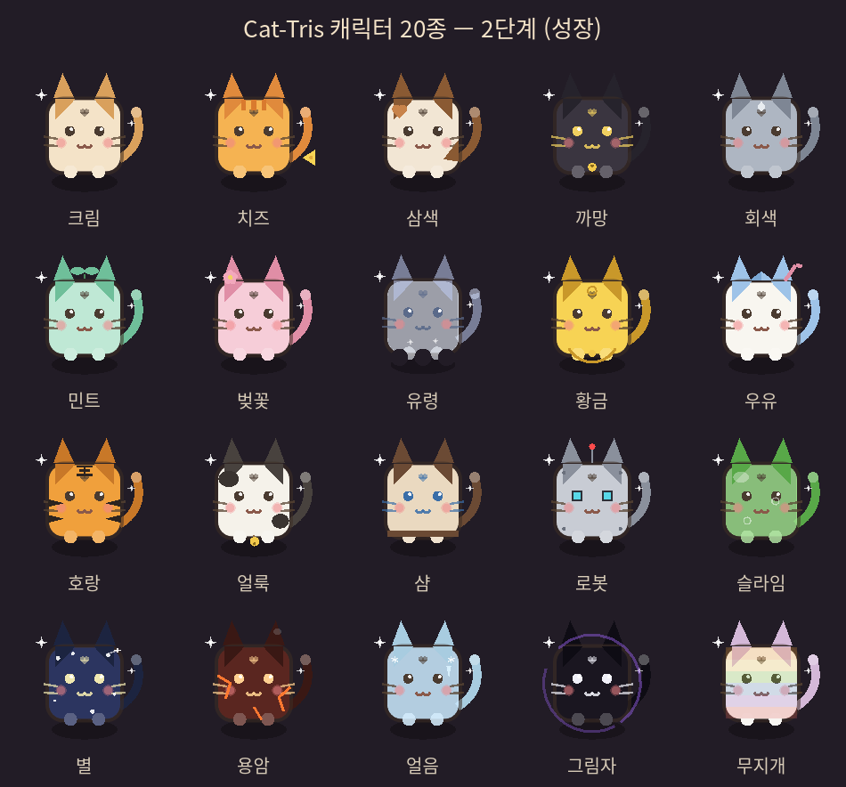
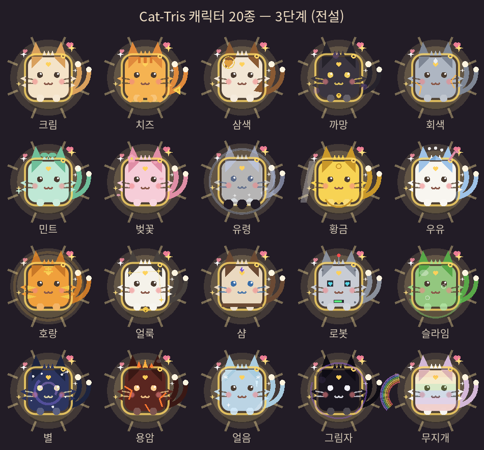

# Cat-Tris 캐릭터 아트 갤러리 — 최종 인엔진 렌더

> 아래 모든 이미지는 Godot 4.6이 **이미지 파일·스프라이트 0장**으로 `_draw()` 프리미티브만 써서 실시간 렌더링한 화면 캡처다.
> 렌더 원본: `tests/character_gallery.tscn` (기존 `Player.paint_cat()` + 캐릭터별 오버레이). 설계 근거·공수 추정: [character_art_spec.md](character_art_spec.md).
>
> 다시 뽑기: `& "<godot>" --path E:\Game\Block res://tests/character_gallery.tscn` → `.tmp_shots/chars/`에 시트 3장 + 애니메이션 45프레임 저장, GIF는 `ffmpeg -framerate 12.5 -i anim_%02d.png ...`로 조립.

## 애니메이션 (3단계 전원, 3.6초 사이클)

Idle(숨쉬기·깜빡임) → Move(기울기) → Jump(스트레치·그림자 축소) → Land(스쿼시) → Dash(잔상). 전부 변형 + 파라미터, 프레임 아트 없음.

캐릭터별 모션 개성: 유령 상시 부유·착지 스쿼시 없음 / 로봇 숨쉬기·깜빡임 없음, 안테나 점멸 / 슬라임 모든 변형 1.6배 / 얼룩 방울 종 스윙 / 황금 샤인 스윕 / 용암 불꽃 왕관 일렁임 / 별 은하 소용돌이 회전.

## 1단계 — 기본 (색 + 무늬)

## 2단계 — 성장 (꼬리 + 테마 소품)

## 3단계 — 전설 (후광 + 시그니처 이펙트)

## 로스터 요약

| 캐릭터 | id | 3단계 시그니처 | 모션 개성 |
|---|---|---|---|
| 크림 | cream | 이중 꼬리 + 금빛 후광 | 표준 모션의 기준 |
| 치즈 | cheese | 녹은 치즈 드립 실루엣 | 착지 스쿼시 1.5배 |
| 삼색 | calico | 하트 얼룩에 금테 | 대시 잔상 3색 |
| 까망 | black | 보라 아지랑이 부유 | 발소리 없는 고요한 이동 |
| 회색 | gray | 돌 균열이 주황으로 발광 | 이륙 직전 강스트레치 |
| 민트 | mint | 민트 별 트레일 | 체공 중 몸이 살짝 늘어남 |
| 벚꽃 | pink | 꽃잎 상시 낙하 | 이동 시 꽃잎 흩날림 |
| 유령 | ghost | 발광 링 + 물결 하단 | 상시 부유·착지 스쿼시 없음 |
| 황금 | gold | 전신 샤인 스윕 | 착지 시 동전 반짝 |
| 우유 | milk | 우유 방울 분수 | 착지 시 방울 튐 |
| 호랑 | tiger | 금빛 줄무늬 + 王 이마 | 대시 잔상 5개 |
| 얼룩 | cow | 얼룩이 별자리로 재배열 | 방울 종 딸랑 스윙 |
| 샴 | siam | 사파이어 눈 + 이마 보석 | 시선 추적이 민감 |
| 로봇 | robo | LED 하트 눈 + 가슴 게이지 | 숨쉬기·깜빡임 없음, 안테나 점멸 |
| 슬라임 | slime | 출렁이는 몸 + 기포 | 모든 변형 1.6배 |
| 별 | star | 회전하는 은하 소용돌이 | 점프 정점에서 반짝 |
| 용암 | lava | 일렁이는 불꽃 왕관 | 균열 발광 맥동 |
| 얼음 | ice | 크리스탈 패싯 + 서리 | 3초마다 입김 퍼프 |
| 그림자 | shadow | 연기로 흩어지는 몸 | 보라 윤곽 일렁임 |
| 무지개 | rainbow | 흐르는 무지개 + 리본 궤적 | 이동 궤적이 정체성 |
